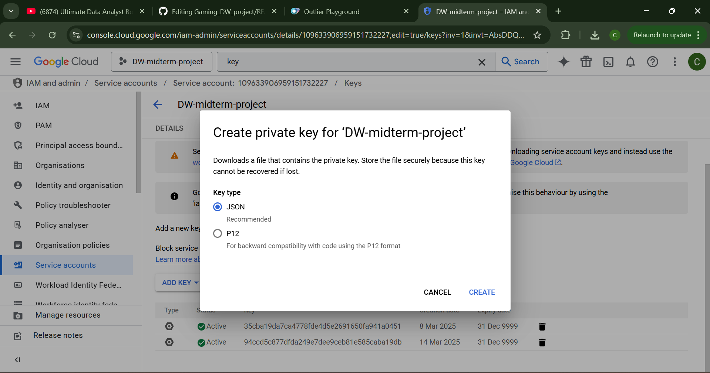
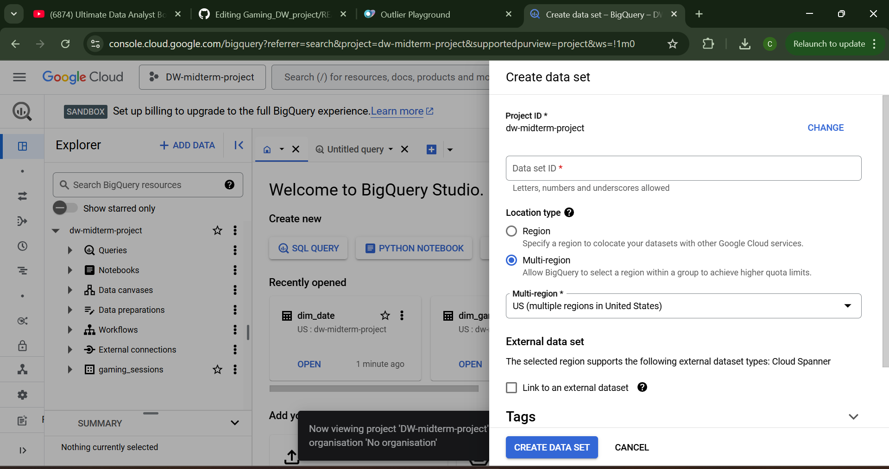

# 🎮 Gaming Data Warehouse Project

## 📚 Project Overview

This project implements a **Gaming Data Warehouse** to analyze player engagement, game sessions, and in-game purchases. The ETL pipeline automates data extraction, transformation, and loading into **Google BigQuery** using **Windows Task Scheduler**.

## 📑 Table of Contents

1. [📁 Project Structure](#project-structure)
2. [⚙️ Setup Instructions](#setup-instructions)
3. [🚀 Running the ETL Pipeline](#running-the-etl-pipeline)
4. [⏰ ETL Automation with Task Scheduler](#etl-automation-with-task-scheduler)

---

## 📁 Project Structure

```
GAMING_DW_PROJECT/
├── datasets/
│   ├── csv.csv                # Contains session data
│   ├── players.csv            # Contains player data
│   ├── purchases.csv          # Contains purchase data
├── documentation/
│   ├── data_dictionary.md     # Documentation for data fields and definitions
│   ├── final_document.pdf     # Final documentation for the project
├── ER_diagram/
│   ├── dimensional_model_schema.png  # Diagram of the dimensional model
│   ├── normalized_schema.png         # Diagram of the normalized schema
├── etl/
│   ├── etl.py                # Main ETL script
│   ├── run_etl.bat           # Batch file to run the ETL process
├── raw-data/
│   ├── game_sessions.csv      # Raw session data
│   ├── players.json           # Raw player data in JSON format
│   ├── purchases.xml          # Raw purchase data in XML format
├── scripts/
│   ├── dimensional_model.sql   # SQL script for creating the dimensional model
│   ├── staging_tables.sql      # SQL script for creating staging tables
├── screenshots/               # Folder containing all necessary screenshots
│   ├── bqroles.png
│   ├── key_o.png
│   ├── key_2.png
│   ├── create_data.png
│   ├── create_data2.png
│   ├── wts.png
│   ├── etl.png
├── LICENSE                    # License file for the project
├── README.md                  # This README file
```

> **Note:** The final documentation includes all the deliverables, scripts and screenshots.

---

## ⚙️ Setup Instructions

### Prerequisites

- **Google Cloud SDK** installed and authenticated.
- **BigQuery enabled** in Google Cloud.
- **Python 3.x** installed.
- **Required Python libraries** (install via pip):
  ```sh
  pip install pandas google-cloud-bigquery
  ```

### Setting Up Google Cloud Authentication

#### Create a Service Account:
1. Go to the [Google Cloud Console](https://console.cloud.google.com/).
2. Navigate to **IAM & Admin > Service Accounts**.
3. Click **Create Service Account**.
4. Provide a name and description for the service account.
5. Click **Create** and then **Continue**.

#### Assign Roles:
- Assign the **BigQuery Admin** role to the service account to allow it to manage BigQuery resources.


#### Create a Key:
1. Click on the service account you just created.
2. Go to the **Keys** tab.


3. Click **Add Key > Create New Key**.
4. Select **JSON** and click **Create**.



This will download a JSON key file to your computer.

#### Set the Environment Variable:

Set the `GOOGLE_APPLICATION_CREDENTIALS` environment variable to the path of the JSON key file.
```sh
set GOOGLE_APPLICATION_CREDENTIALS=C:\path\to\your\key.json
```

#### Configuring BigQuery

- **Create a Dataset**:
  1. Navigate to **BigQuery** in Google Cloud Console.
  2. Click on your project name in the left-hand panel.
  3. Click **Create Dataset**.
  4. Provide a name and configure any additional settings.




- **Upload the raw datasets as CSV files** (`purchases.csv`, `players.csv`, `csv.csv(sessions)`).

- **Create Tables**:
  Use the SQL scripts in the `scripts/` directory to create the necessary tables in your BigQuery dataset.

---
## 🚀 Running the ETL Pipeline

You can run the ETL pipeline manually or rely on the scheduled task.

### Manual Execution

1. **Open a Command Prompt**:
   - Press `Win + R`, type `cmd`, and press `Enter`.

2. **Navigate to the ETL Directory**:
   ```sh
   cd path\to\your\project\etl
   ```

3. **Run the ETL Script**:
   ```sh
   python etl.py
   ```


---
## ⏰ ETL Automation with Task Scheduler

To automate the ETL pipeline, use **Windows Task Scheduler**.

### Schedule the Task

1. **Open Task Scheduler**:
   - Press `Win + R`, type `taskschd.msc`, and press `Enter`.

2. **Create a Basic Task**:
   - Click **Create Basic Task** in the Actions pane.
   - Provide a name, e.g., **Gaming_ETL_Job**, and click **Next**.

3. **Set the Trigger**:
   - Choose **Daily** or **Hourly**.
   - Configure the time and frequency settings.

4. **Select the Action**:
   - Choose **Start a Program** and click **Next**.

5. **Specify the Program**:
   - Click **Browse** and select `run_etl.bat` from your project directory.

6. **Finish the Task Setup**:
   - Click **Finish** to create the task.
   - Ensure the task is enabled.


---

### Final Steps

- Ensure that your Python environment is correctly set up.
- Verify Google Cloud SDK authentication.
- Test the ETL script manually before enabling automation.

> **Note:** Keep your JSON key file secure, as it contains sensitive authentication credentials.


